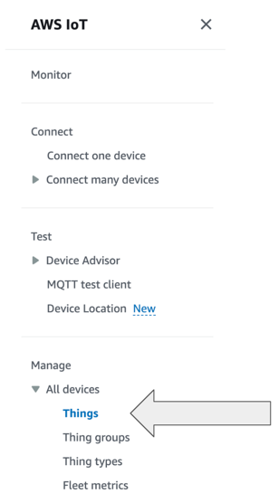

# Hands On AWS IoT Core: Shadows

## Pre requisites

You need to install the python dependencies with:

```shell
pip install -r requirements.txt
```

## Context

During this hands-on we are going to simulate a connected lightbulb connected to IoT Core with a shadow to store its state


After we will store the states of the light bulb into a DynamoBD table using an AWS IoT Rule


## Tasks


### Part 1: Iot Core setup

#### First we will have to setup AWS IoT Core:

We'll need to create some AWS resources :


First connect to your AWS Console and go the to **IoT Core** service and make sure that you are in the **eu-west-1** region.

Then you'll go on the *Things* section under *Manage* and *All devices*


You can now click on **Create Things** and follow the setup steps to create a thing with the name **lightbulb-1**
and **No shadow** option selected.

For the certificate part, pick "Auto-generate a new certificate (recommended)"

Now for the policy part we will need to create a new policy so click on the **Create policy** button on the upper right, it will open a new tab

We are going to name our policy: **lightbulb_policy**, on the Policy Document section you will choose **JSON** to build the policy.

Then you are going to use the following policy and replace **<ACCOUNT_ID>** (which is a 12 digits number) by your account ID that can be find in the upper right corner of the AWS Console (without the "-")


```json
{
  "Version": "2012-10-17",
  "Statement": [
    {
      "Effect": "Allow",
      "Action": [
        "iot:Publish"
      ],
      "Resource": [
        "arn:aws:iot:eu-west-1:<ACCOUNT_ID>:topic/$aws/things/lightbulb-1/shadow/get",
        "arn:aws:iot:eu-west-1:<ACCOUNT_ID>:topic/$aws/things/lightbulb-1/shadow/update"
      ]
    },
    {
      "Effect": "Allow",
      "Action": [
        "iot:Receive"
      ],
      "Resource": [
        "arn:aws:iot:eu-west-1:<ACCOUNT_ID>:topic/$aws/things/lightbulb-1/shadow/get/accepted",
        "arn:aws:iot:eu-west-1:<ACCOUNT_ID>:topic/$aws/things/lightbulb-1/shadow/get/rejected",
        "arn:aws:iot:eu-west-1:<ACCOUNT_ID>:topic/$aws/things/lightbulb-1/shadow/update/accepted",
        "arn:aws:iot:eu-west-1:<ACCOUNT_ID>:topic/$aws/things/lightbulb-1/shadow/update/rejected",
        "arn:aws:iot:eu-west-1:<ACCOUNT_ID>:topic/$aws/things/lightbulb-1/shadow/update/delta"
      ]
    },
    {
      "Effect": "Allow",
      "Action": [
        "iot:Subscribe"
      ],
      "Resource": [
        "arn:aws:iot:eu-west-1:<ACCOUNT_ID>:topicfilter/$aws/things/lightbulb-1/shadow/get/accepted",
        "arn:aws:iot:eu-west-1:<ACCOUNT_ID>:topicfilter/$aws/things/lightbulb-1/shadow/get/rejected",
        "arn:aws:iot:eu-west-1:<ACCOUNT_ID>:topicfilter/$aws/things/lightbulb-1/shadow/update/accepted",
        "arn:aws:iot:eu-west-1:<ACCOUNT_ID>:topicfilter/$aws/things/lightbulb-1/shadow/update/rejected",
        "arn:aws:iot:eu-west-1:<ACCOUNT_ID>:topicfilter/$aws/things/lightbulb-1/shadow/update/delta"
      ]
    },
    {
      "Effect": "Allow",
      "Action": "iot:Connect",
      "Resource": "arn:aws:iot:eu-west-1:<ACCOUNT_ID>:client/test-*"
    }
  ]
}
```

After creating the policy you can go back to the other tab (with the Thing creation) and you should see the newly created policy,
you can select it and click on **Create thing**

A pop up appears, you will need to download the **Device certificate**, the **Public key file**, the **Private key file**
and the **RSA 2048 bit key: Amazon Root CA 1** files.

You can copy all these files into the **files** directory of the project.

### Part 2: Run the light bulb

Now to launch the lightbulb simulation you will need to run the following command

````shell
python3 shadow.py --endpoint <endpoint> --ca_file <file> --cert <file> --key <file> --thing_name <name>
````

The endpoint can be found in the **Settings** section of IoT Core -> Device data endpoint


The ca_file will be the Amazon Root CA 1, the cert file is the file that ends with pem.cert,
the key file is the private key that ends with private.pem.key
and finally the thing_name is lightbulb-1

The shadow.py script will first subscribe to the shadow **get**, **update** and **delta** topics, it is necessary to retrieve information
from IoT Core,
it will then publish a message in the shadow get topics to retrieve the shadow state if exists or create it if it doesn't exist.

You can then write in the terminal where you run the shadow.py the color you want for the light bulb (blue, white, red..),
then you will go on the AWS Console in the Things Section, click on your Thing (lightbulb-1), then go on the **Device Shadow** section in
the bottom of the page, click on the Classic Shadow that should be named $aws/things/lightbulb-1/shadow and in the Device Shadow Document
you should see the updated Shadow State


We can now update the Shadow state directly from the AWS Console by clicking on the **Edit** button
You should see in your terminal that the lightbulb have updated its state

Finally, you can disconnect the light bulb by entering **quit** in the terminal, then go change the state in the AWS Console
and run again the shadow.py script, it will directly synchronize with the remote shadow state and update it's local state to the 
one you have set on the AWS Console.


### Part 3: DynamoDB + IoT Rule

Now that our light bulb is synchronized with IoT Core through the Shadow we would like to create a dynamoDB that stores every
changes that happens to the lightbulb, to do so we'll need first to create a DynamoDB table.

The IoT rule will read the messages that arrives to the topic *'$aws/things/+/shadow/update'*  
where "+" represents everything so it will work with the topic '$aws/things/lightbulb-1/shadow/update'


Go to the DynamoDB service and click on **Create Table**, the table will be called **light-bulb-activity** and the PartitionKey 
will be **lightBulbId** you can then scroll down and click to **Create table**

Now we have to create the IoT Rule to read from the IoT Core Topic and write to the DynamoDB:

Go to the IoT Core service and go on the Manage/Message routing/Rules section 


Create a rule called **light_bulb_activity** then click **Next**, after that you will write the following SQL Statement in the editor:

```sql
SELECT clientid() as lightBulbId, state.desired.color, timestamp() AS timestamp FROM '$aws/things/+/shadow/update'
```

This query will retrieve the clientId of the message as the lightBulbId, the color contained in the state and a timestamp

You can click Next and then as the Action1 you will select **DynamoDBv2**, you'll choose the DynamoDB Table you've created earlier,
then you will click on **Create new role** to allow the IoT Core service to write into the DB, call it lightbulb_dynamo_role, select it 
in the role selector and then click Next and Create in the next page.

Now you're all setup and can run the python script again

````shell
python3 shadow.py --endpoint <endpoint> --ca_file <file> --cert <file> --key <file> --thing_name <name>
````

now when you ask a new color in your terminal you should see a message in the DynamoDB Table:


Of course if you have multiple lightbulb connected this will still work as the clientId is unique for each one and the IoT Rule
take all the topics in it's regExp
